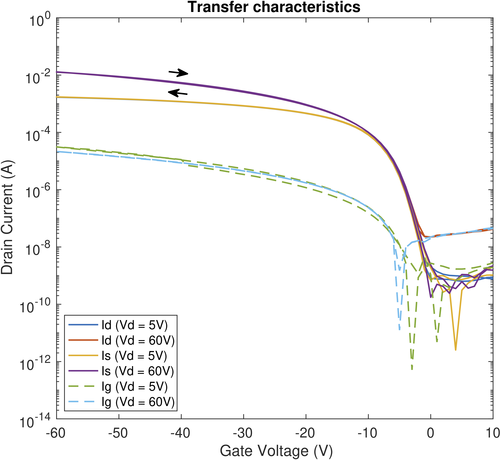
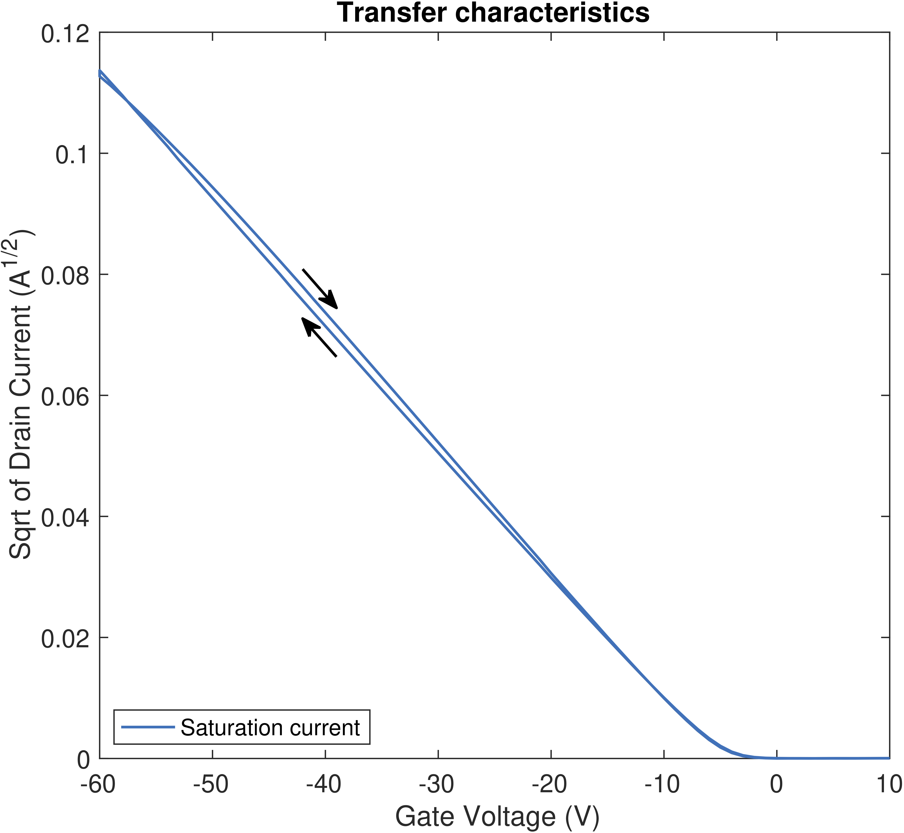

# FET-Analyses

MATLAB scripts to load, plot, and analyze FET sweep data.

## Installation

Download the scripts from github, for instance with:
```
$ git clone https://github.com/OE-FET/FET-Analyses
```
and add them to your MATLAB folder.

## Usage
Use `FETDataRead` to read transfer and output curves saved by the Testing Rig or ESR setup. Since the two setups use different file formats, `FETDataRead` will search through the column headers to identify the file type ('transfer' or 'output') and possible linear and saturation sweep data. `FETDataRead` returns a MATLAB structure containing the stepped voltages (e.g., drain voltage steps in a transfer curve) as `data.Vstep`, the sweep type as `data.type` and the actual data as `data.x`, `data.Is`, `data.Id` and `data.Ig`.

Use `TransferDataPlot` and `OutputDataPlot` to plot the output of `FETDataRead`. If forward and reverse sweeps have been recorded, the direction of the hysteresis loop will be indicated by arrows.

<p float="centre">
   &nbsp;&nbsp;&nbsp;&nbsp;
  
  &nbsp;&nbsp;&nbsp;&nbsp;
   
</p>

Use `MobilityVsVg` and `MobilityCalc` to calculate gate-voltage dependent and independent mobilities, respectively. In addition to the FET data structure, an argument `pars` containing the FET parameters (channel length and width, dielectric constant, etc) must be provided. If any of the arguments is missing, the user will be asked to provide them.

_Example:_

```MATLAB
% load and plot transfer curve
data = FETDataRead();
TransferDataPlot(data);

% set FET parameters
epsilon = 2.05; % dielectric constant CYTOP
epsilon_0 = 8.854187817*1e-12; % in F/m

pars.W = 1e-3; % channel width in m
pars.L = 20*1e-6; % channel length in m
pars.d = 620*1e-9; % dielectric thickness in m
pars.C = epsilon_0*epsilon/pars.d; % capacitance in F/m^2

% calculate mobility
[vg, mobSatVg, mobLinVg] = MobilityVsVg(data, pars);
```
